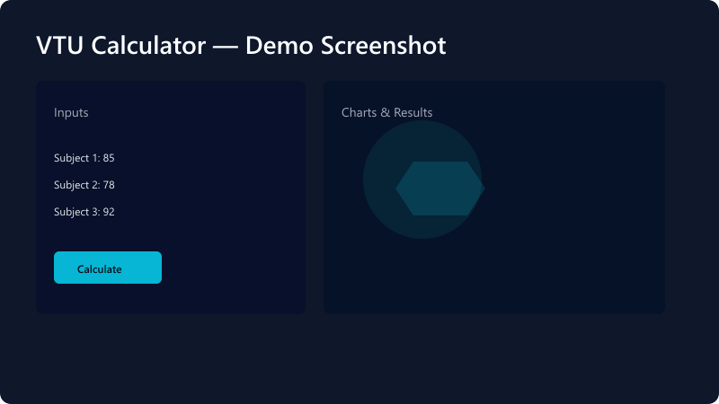

# VTU SGPA Calculator ⚡

[](https://github.com/theanikeeeeet/VTU-SGPA-CALCULATOR/actions/workflows/ci.yml)

**VTU SGPA Calculator** is a lightweight React app to help VTU students calculate semester SGPA/CGPA, visualize subject marks with charts, and export results. This repository contains the source code, contribution guidelines, and information to run, test, and extend the project.

---

## 🔍 Demo



> Tip: Replace `assets/screenshot.png` with an actual screenshot image (or `assets/screenshot.jpg`) to show the app UI in the README.

---

## 🚀 Features

- Easy input UI for subject marks and credits
- Live visualizations using Chart.js for mark distribution and trends
- Export results (PDF/screenshot) for record keeping
- Responsive, accessible UI built with React
- Simple zero-configuration developer experience (Create React App)

---

## 🧰 Tech Stack

- React
- Chart.js
- html2canvas + jsPDF (for exports)
- Create React App

---

## 💻 Quick Start

### Prerequisites
- Node.js v16 or later
- npm

### Clone the repo

```bash
git clone https://github.com/theanikeeeeet/VTU-SGPA-CALCULATOR.git
cd VTU-SGPA-CALCULATOR
```

### Install dependencies

```bash
npm install
```

### Run in development

```bash
npm start
```

Open http://localhost:3000 in your browser. The app reloads automatically when you edit files.

### Build for production

```bash
npm run build
```

The production-ready files will be in the `build/` directory.

### Tests

```bash
npm test
```

---

## 📁 Project Structure

- `src/` — application source code
- `public/` — static files and `index.html`
- `assets/` — images/screenshots used in the README or app
- `package.json` — scripts and dependencies

---

## 🛠️ Development Notes

- You can run ESLint and Prettier if configured in the project.
- To capture a screenshot for the README, run the app locally and save a screenshot to `assets/screenshot.png`.

---

## 🤝 Contributing

Contributions are welcome! Please read `CONTRIBUTING.md` for guidelines on reporting issues, proposing changes, and submitting pull requests. Be sure to:

- Fork the repo
- Create a feature branch
- Add tests where appropriate
- Submit a clear PR description

---

## 📄 License

This project is licensed under the MIT License — see the `LICENSE` file for details.

---

## 📬 Contact

If you have questions, feature requests, or suggestions, open an issue or submit a PR on GitHub: https://github.com/theanikeeeeet/VTU-SGPA-CALCULATOR

---

### Acknowledgements

Thanks to the open-source libraries and communities that make projects like this possible.

